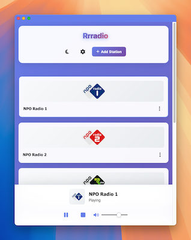

# 🎵 Rrradio - Modern Web Radio Player

[](https://docker.com)
[](https://azure.microsoft.com/en-us/services/container-apps/)
[](LICENSE)
[](https://developer.mozilla.org/en-US/docs/Web/Progressive_web_apps)

A modern, responsive web radio player that lets you stream your favorite radio stations directly in your browser. Built with vanilla JavaScript and containerized for easy deployment anywhere.



## ✨ Features

- 🎵 **Stream Radio Stations**: Play your favorite radio streams directly in the browser
- 📱 **Responsive Design**: Works perfectly on desktop, tablet, and mobile devices
- 💾 **Local Storage**: All your radio stations are stored locally in your browser
- ➕ **Station Management**: Easily add, edit, and remove radio stations
- 📻 **Default Presets**: Comes with sample stations to get you started
- 🎨 **Modern UI**: Beautiful gradient design with smooth animations
- 🔊 **Full Audio Controls**: Play, pause, stop, and volume control
- 🐳 **Docker Ready**: Easy deployment with Docker containerization
- ☁️ **Azure Deployment**: Production-ready Azure Container Apps setup
- 📲 **PWA Support**: Install as a native app on mobile devices

## 🚀 Quick Start

### Option 1: Docker (Recommended)

```bash
# Clone the repository
git clone https://github.com/rutgersmit/rrradio.git
cd rrradio

# Run with Docker Compose
docker compose up -d

# Open your browser to http://localhost:8080
```

### Option 2: Direct File Serving

```bash
# Clone the repository
git clone https://github.com/rutgersmit/rrradio.git
cd rrradio

# Serve files using any static server
python -m http.server 8080
# or
npx serve -s src -l 8080

# Open your browser to http://localhost:8080
```

## 🏗️ Architecture

**Cloud-Native Design**: Originally built for Azure Static Web Apps, now enhanced with containerization for Azure Container Apps deployment.

### Core Components

- **Frontend**: Pure HTML5, CSS3, and JavaScript (no frameworks required)
- **Container**: Nginx-based Docker container for production deployment
- **Storage**: Browser localStorage for user data persistence
- **Audio Engine**: HTML5 Audio API for seamless streaming

### Azure Infrastructure

- **Azure Container Apps**: Hosts the containerized application
- **Azure Container Registry**: Stores Docker images
- **Azure Log Analytics**: Centralized logging and monitoring
- **Application Insights**: Performance monitoring and error tracking

## 🚀 Deploy to Azure

Want to deploy your own instance to Azure? This project includes everything you need for a production deployment.

### Prerequisites

1. Azure subscription
2. Azure CLI installed and logged in
3. Azure Developer CLI (azd) installed

### One-Click Azure Deployment

1. **Initialize your environment:**

   ```bash
   azd env new <environment-name>
   ```

2. **Configure your deployment region:**

   ```bash
   azd env set AZURE_LOCATION <your-azure-region>
   # Example: azd env set AZURE_LOCATION eastus2
   ```

3. **Deploy everything with one command:**

   ```bash
   azd up
   ```

   This command will:
   - Provision all Azure resources (Container Apps Environment, Container Registry, etc.)
   - Build and push the Docker image to your registry
   - Deploy the container to Azure Container Apps
   - Set up monitoring and logging

### CI/CD with GitHub Actions

For automated deployments, this project includes GitHub Actions workflows:

1. **Create an Azure Service Principal:**

   ```bash
   az ad sp create-for-rbac --name "rrradio-github-actions" \
     --role contributor \
     --scopes /subscriptions/<subscription-id>
   ```

2. **Configure GitHub Repository Secrets:**
   - `AZURE_CLIENT_ID`: Service principal client ID
   - `AZURE_TENANT_ID`: Azure tenant ID  
   - `AZURE_CREDENTIALS`: Complete service principal JSON

3. **Configure GitHub Repository Variables:**
   - `AZURE_ENV_NAME`: Your environment name
   - `AZURE_LOCATION`: Your Azure region
   - `AZURE_SUBSCRIPTION_ID`: Your Azure subscription ID

4. **Deploy automatically:** Push to the `main` branch to trigger deployment

## 📱 How to Use

### Getting Started

When you first open Rrradio, you'll see 6 sample radio stations to get you started:

- **Jazz FM** - Smooth jazz for relaxing
- **Rock Central** - Classic and modern rock hits  
- **Classical Radio** - Beautiful classical compositions
- **Electronic Beats** - Electronic and dance music
- **News Radio 24/7** - Stay informed with news
- **Chill Lounge** - Ambient and chill-out music

*Note: Sample stations use placeholder URLs. Add your own real radio stream URLs!*

### Adding Your Own Stations

1. Click the "**Add Station**" button
2. Fill in the station details:
   - **Station Name**: Give it a memorable name
   - **Stream URL**: The direct URL to the radio stream (usually ends in .mp3, .m3u, or .pls)
   - **Image URL**: Optional cover image for the station
3. Click "**Add Station**" to save

### Playing Music

- **Start Playing**: Click on any station card
- **Control Playback**: Use the audio player controls at the bottom
- **Switch Stations**: Click another station to switch immediately
- **Volume Control**: Adjust volume with the slider

### Managing Your Collection

- **Edit Station**: Click the "Edit" button on any station card
- **Remove Station**: Click "Remove" to delete a station permanently
- **Auto-Save**: All changes are automatically saved to your browser

## 🛠️ Development

### Local Development Setup

```bash
# Clone the repository
git clone https://github.com/rutgersmit/rrradio.git
cd rrradio

# For quick development, use Docker Compose
docker compose up -d

# For manual development
cd src
python -m http.server 8080
```

### Development Scripts

Convenient scripts for common development tasks:

```bash
# Full rebuild and restart (after code changes)
./rebuild.sh

# Quick restart without rebuilding
./restart.sh

# View application logs
./logs.sh
```

### Project Structure

```text
rrradio/
├── 📁 src/                     # Application source files
│   ├── 🏠 index.html          # Main HTML file
│   ├── 🎨 styles.css          # Application styles  
│   ├── ⚡ script.js           # Application logic
│   ├── 📱 manifest.json       # PWA manifest
│   ├── 🔧 sw.js              # Service worker
│   └── 📁 img/               # Images and icons
├── 🐳 docker/                 # Docker configuration
│   ├── 📋 Dockerfile          # Container definition
│   ├── 🔧 docker-compose.yml  # Development setup
│   └── ⚙️ nginx.conf          # Web server config
├── ☁️ infra/                  # Azure infrastructure
│   ├── 🏗️ main.bicep          # Infrastructure as Code
│   └── ⚙️ main.parameters.json # Deployment parameters
├── 🔧 scripts/               # Development helpers
└── 📋 azure.yaml             # Azure Developer CLI config
```

## 🔧 Technical Details

### Core Technologies

- **Frontend**: Pure HTML5, CSS3, and JavaScript (no frameworks)
- **Audio Engine**: HTML5 Audio API for streaming
- **Storage**: Browser localStorage for data persistence
- **Server**: Nginx (in Docker container)
- **Containerization**: Docker with multi-stage builds
- **Cloud**: Azure Container Apps for scalable hosting

### Browser Compatibility

- ✅ **Chrome** 60+
- ✅ **Firefox** 55+  
- ✅ **Safari** 11+
- ✅ **Edge** 79+
- 📱 **Mobile browsers** supported

### Audio Features

- **Streaming Support**: MP3, AAC, and other HTML5-supported formats
- **Real-time Controls**: Play, pause, stop, volume adjustment
- **Error Handling**: Graceful handling of invalid streams
- **Status Updates**: Live playback status and metadata display

## 📻 Finding Radio Streams

Here are some reliable sources for radio stream URLs:

### Public Radio Directories

- **Radio-Browser.info**: Community-driven radio station database
- **Internet-Radio.com**: Large collection of streaming stations  
- **TuneIn**: Popular radio aggregator (check for direct stream URLs)

### Example Stream Formats

```text
Direct MP3: http://example.com/stream.mp3
M3U Playlist: http://example.com/playlist.m3u
PLS Playlist: http://example.com/stream.pls
```

### Testing Stream URLs

Always test stream URLs in your browser before adding them:

1. Copy the URL
2. Paste it into a new browser tab
3. If it starts downloading or playing, it should work in Rrradio

## 🐛 Troubleshooting

### Common Issues

#### 🔇 Audio Not Playing

- Verify the stream URL is accessible and valid
- Check if the stream format is supported by your browser
- Look for CORS issues in the browser developer console
- Try the stream URL directly in your browser

#### 💾 Stations Not Saving

- Ensure localStorage is enabled in your browser
- Disable private/incognito browsing mode
- Clear browser cache and cookies for the site
- Check available storage space

#### 🐳 Docker Issues

- Verify Docker is running: `docker --version`
- Check if port 8080 is available: `lsof -i :8080`
- Review container logs: `docker compose logs -f`
- Try rebuilding: `docker compose up --build`

### Getting Help

If you encounter issues:

1. **Check the browser console** for error messages
2. **Verify stream URLs** work in other players
3. **Test with different browsers** to isolate issues
4. **Open an issue** on GitHub with detailed information

## 🤝 Contributing

We welcome contributions! Here's how to get started:

### Development Setup

1. **Fork and clone** the repository
2. **Create a feature branch**: `git checkout -b feature/amazing-feature`
3. **Make your changes** and test thoroughly
4. **Follow the code style** (ESLint configuration coming soon)
5. **Submit a pull request** with a clear description

### Areas for Contribution

- 🎨 **UI/UX improvements** and themes
- 🔧 **New features** and functionality  
- 🐛 **Bug fixes** and performance optimizations
- 📱 **Mobile experience** enhancements
- 🌍 **Internationalization** support
- 📚 **Documentation** improvements

### Code Guidelines

- Use vanilla JavaScript (no frameworks)
- Follow existing code patterns and naming conventions
- Add comments for complex logic
- Test your changes across different browsers
- Update documentation as needed

## 🚀 Deployment Options

### Hosting Platforms

**Azure Container Apps** (Recommended)

- Full Azure integration with monitoring
- Auto-scaling and load balancing  
- Integrated CI/CD with GitHub Actions

#### Docker-Compatible Platforms

- Google Cloud Run
- AWS Fargate
- DigitalOcean App Platform
- Railway, Render, Fly.io

**Static Hosting** (Basic)

- GitHub Pages
- Netlify
- Vercel
- Azure Static Web Apps

## 🛡️ Security & Privacy

### Data Handling

- **No server-side data storage**: All user data stays in your browser
- **No tracking**: We don't collect or transmit any personal information
- **No cookies**: Pure localStorage implementation
- **HTTPS recommended**: Use HTTPS for production deployments

### Stream Privacy

- Radio streams are accessed directly by your browser
- No proxy or intermediary servers involved
- Streams subject to their own privacy policies

## 📄 License

MIT License - see the [LICENSE](LICENSE) file for details.

This project is open source and free to use, modify, and distribute.

## 🙏 Acknowledgments

- **Icons**: From various open source icon libraries
- **Inspiration**: Classic radio players and modern web design
- **Community**: Thanks to all contributors and users!

---

**⭐ Star this project** if you find it useful!

**🐛 Found a bug?** Please [open an issue](https://github.com/rutgersmit/rrradio/issues).

**💡 Have an idea?** We'd love to hear about it in [discussions](https://github.com/rutgersmit/rrradio/discussions).
